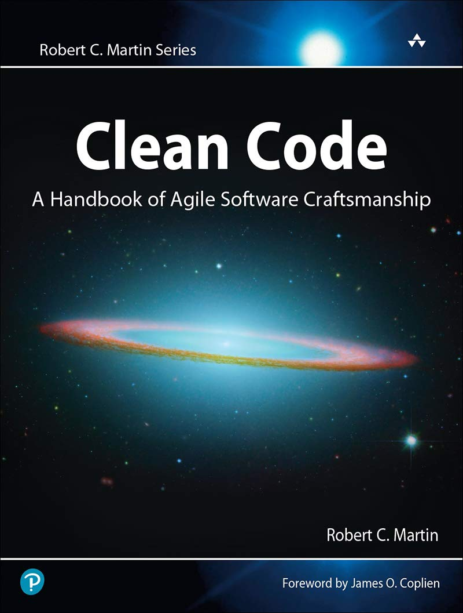

# Clean code scrutiny, A bottom up approach
Comprehensive abstract for clean code concepts

## Table of content
- [Introduction](notes/00_Introduction.md)
- [Chapter 1: Clean code](notes/01_Chapter_1_Clean_code.md)
- [Chapter 2: Meaningful names](notes/02_Chapter_2_Meaningful_names.md)
- [Chapter 3: Functions](notes/03_Chapter_3_Functions.md)
- [Chapter 4: Comments]()
- [Chapter 5: Formatting]()
- [Chapter 6: Objects and Data structures]()
- [Chapter 7: Error handling]()
- [Chapter 8: Boundaries]()
- [Chapter 9: Unit tests]()
- [Chapter 10: Classes]()
- [Chapter 11: Systems]()
- [Chapter 12: Emergence]()
- [Chapter 13: Concurrency]()
- [Chapter 14: Successive Refinement]()
- [Chapter 15: Junit Internals]()
- [Chapter 16: Refactoring SerialDate]()
- [Chapter 17: Smells and Heuristics]()
- [Appendix A: Concurrency ii]()

## Source code examples
- [Snippets](src/main/java/clean/code)
- [Tests](src/test/java)