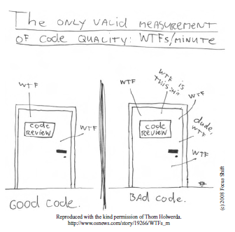

# Introduction
## How to know if code is dirty
[[Slide](../slides/00_Introduction.pptx)]

When reading someones code, if you find a portion of code ambigious
you say WTF is this (Use surprise word for public, it's more polite)
how am I supposed to know what's going on here

**Code quality = WTFs/Minute**

